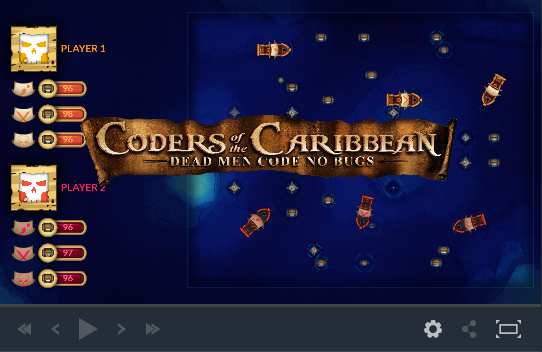
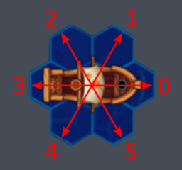

# codingame-contests-coders_of_the_caribbean
5,047 CodinGamers have registered to this contest

https://www.codingame.com/contests/coders-of-the-caribbean

This is a league based challenge.
For this challenge, multiple versions of the same game are available. Once you have proven your skills on this first version, you will access a higher league and extra rules will be unlocked.

## The Goal

In this game, you are in command of pirate ships and your goal is to avoid running out of rum. If all the rum dries up on a given ship, your crew will go mad and you will lose the ship. Barrels of rum are placed randomly across the map. You must control the movements of your ship in order to collect the barrels of rum before your opponent does.

## Rules

The game is played on a hexagonal grid 23 cells wide and 21 high.

Both players have one ship (and up to 3 in later leagues). Every ship is 3 cells long and 1 cell wide.

On the grid you will find barrels of rum (BARREL). The barrels contain between 10 and 20 units of rum. Each ship can carry a maximum of 100 units of rum (surplus will be lost).

Each turn, the players can decide to move their ship towards the cell of their choice using the MOVE command. Ships can gain speed, slow down, turn left (port) or right (starboard). The MOVE action uses a very simplified algorithm to reach the destination.
Note: you may choose to use the WAIT command, in which case your boat will retain the direction and speed it had last turn. Using the SLOWER command will slow your ship down.

### Game turns:

One game turn is computed as follows:
- The amount of rum each ship is carrying is decreased by 1 unit.
- The players' commands are applied.
- Ships move forward by the same number of cells as their speed.
- Ships turn.
- Elimination of ships with no more rum.

If at any point during its movement a ship shares a cell with a barrel of rum, the ship collects that rum.

### The grid:

The (0,0) coordinate is at the top left corner of the grid. The game's grid is made up of hexagonal cells but, for this league, you don't need to worry too much about it. Simply use the MOVE command to move around: that's as easy as moving on a normal grid. More information about the nuts and bolts of an hex grid will be provided in the next leagues.

### The ships:

A ship's position in the grid is represented by the coordinates of its center and its direction. The direction is a number between 0 and 5.

Direction of a ship
- A ship can have one of the 6 directions shown above.
 
### Victory Conditions
- Your opponent runs out of rum.
- After 200 turns, you have more rum in total than your opponent.

## Expert Rules

### Collisions

You don't need to worry about the collisions in this league. The collision mechanism will be explained in the next leagues.

### Source code:

The source code of the game is available on our Github at this address: https://github.com/CodinGame/coders-of-the-caribbean/

## Game Input

### Input for one game turn

- Line 1: myShipCount, an integer for the number of ships you control.
- Line 2 : entityCount, an integer for the number of entities on the grid.
- The next entityCount lines: an integer entityId, a string entityType, two integers x and y for the coordinates of the entity, then 4 integers arg1, arg2, arg3 and arg4.

If entityType equals SHIP, then the integers represent:
- arg1: the ship's rotation orientation (between 0 and 5)
- arg2: the ship's speed (between 0 and 2)
- arg3: the ship's stock of rum units
- arg4: 1 if the ship is controlled by you, 0 otherwise

If entityType equals BARREL, then the integers represent:
- arg1: the amount of rum in this barrel

### Output for one game turn
For each one of your ships, one of the following commands:
- MOVE x y: move automatically towards the specified coordinate.
- SLOWER: speed the ship down.
- WAIT: perform no action.

### Constraints

- myShipCount = 1
- 10 ≤ rumBarrelCount ≤ 26
- 0 ≤ x ≤ 22
- 0 ≤ y ≤ 20
- 0 ≤ shipSpeed ≤ 2
- Response time for first turn ≤ 1000ms
- Response time for one turn ≤ 50ms

## What is in store for me in the higher leagues?

The extra rules available in higher leagues are:
- Shoot cannon balls at your opponent and place mines on the map.
- Control up to 3 ships at once.
- Steer the ships manually for more precise control. The ships can go twice as fast.
