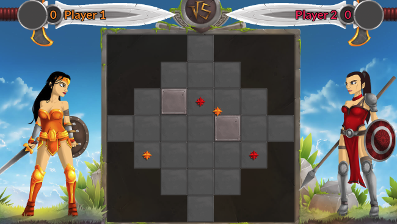

# contests-wondev_woman
905 CodinGamers have registered to this contest

https://www.codingame.com/contests/wondev-woman

This is a league based challenge.
For this challenge, multiple versions of the same game are available. Once you have proven your skills on this first version, you will access a higher league and extra rules will be unlocked.

---

## The Goal

Reach a height of 3 levels before your opponent.

## Rules

The game is played on a square grid of a given size. Both players start with one unit placed randomly on the grid.

Both players take it in turns to perform an action with their unit. To win the game, players must get their unit to climb up cells and reach a height of 3 levels.

### The grid
- Cells can be floors or holes. A floor is represented by an integer, a hole is represented by a dot (.). Holes are considered as outside the playable area.
- Each cell in the playable area has a height going from 0 to 3. A height of 4 is outside the playable area.

### The units
- Each unit occupies a cell in the playable area of the grid and has the power to MOVE and then BUILD.
- A unit may move to any neighboring cell, including diagonals. The unit may only move on the same level, step up one level or step down any number of levels.
- After every movement, the unit must be able to build onto an adjacent cell of its new position. This causes the cell in question to gain 1 unit of height. If the height reaches level 4, the cell is considered removed from play.
- If your unit moves onto a level 3 cell, you win the game.

### Actions 
Every turn, your unit must perform a valid pair of actions:
- MOVE&BUILD: The unit moves in a given direction on the grid, then places an extra level on a neighboring cell.

### Victory Conditions
Your unit reaches the third level.
 
### Lose Conditions
You perform an invalid action or do not respond in time.

---

## Game Input

### Initialization input
Line 1: an integer size for the size of the square grid.

Line 2: an integer unitsPerPlayer for the number of units each player controls. Always 1 for this league.

### Input for one game turn
First size lines: size characters representing one row of the grid. A dot (.) for an unplayable cell or an integer height for the cell's current level.

Next unitsPerPlayer lines: unitX, unitY the coordinates of one of your units.

Next unitsPerPlayer lines: otherX, otherY the coordinates of one of your opponent's units. 

If the unit is not visible to you, the values will be -1 -1.

Next line: legalActions, an integer for the number of valid actions you may play this turn.

Next legalActionslines: atype, index, dir1, dir2: the parameters of a valid command you may output this turn. 

For instance, in the action MOVE&BUILD 0 N SW, atype is MOVE&BUILD, index designates the unit at index 0, which may move north and build to the south-west. 

### Output for one game turn
One line: MOVE&BUILD followed by index for the unit you wish to perform the action (Always 0 for this league), dir1 for the direction in which the unit will move, dir2 for the direction of the cell the unit will raise the level of. 

You may append text to your action, it will be displayed in the viewer.
The possible directions are: N, NE, E, SE, S, SW, W, NW.

### Constraints
- 5 ≤ size ≤ 7 
- unitsPerPlayer = 1 
- 0 ≤ legalActions ≤ 64 
- Response time per turn ≤ 50ms 
- Response time for the first turn ≤ 1000ms

